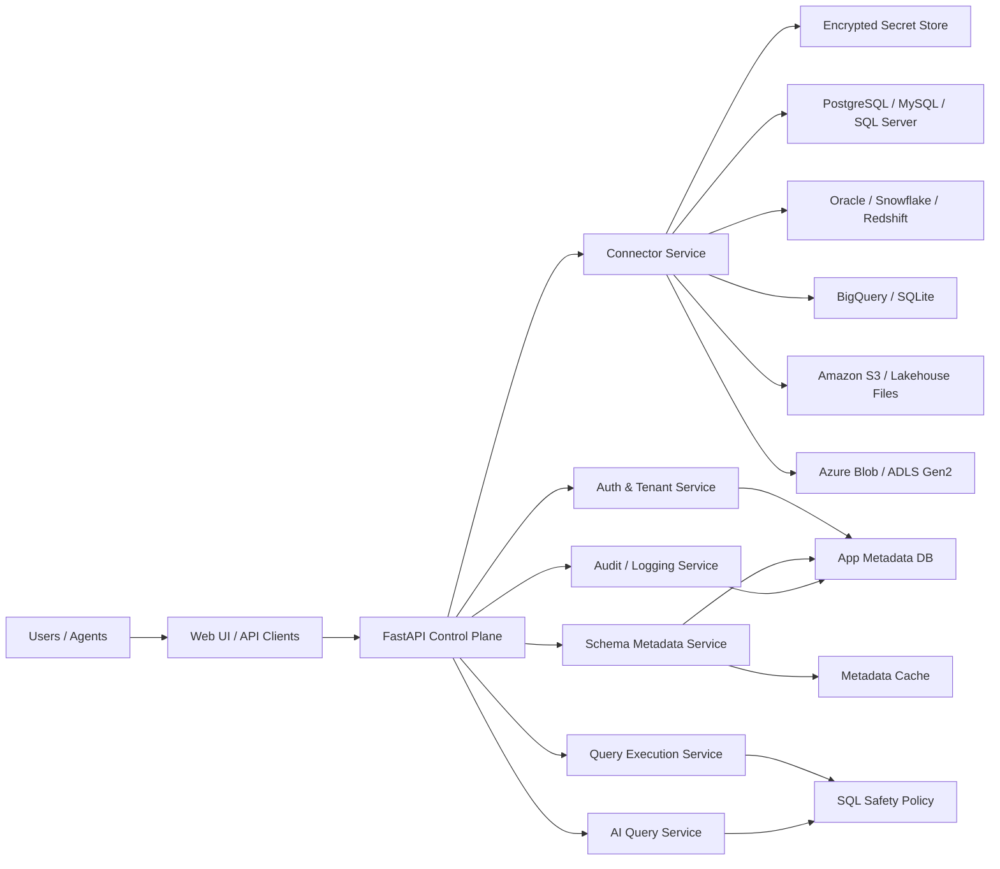

# AI Data Middleware End Product Blueprint

## Product Goal

AI Data Middleware becomes a secure, multi-tenant SaaS layer that lets any user:

1. Connect a supported database or cloud data source
2. Inspect schema automatically
3. Ask questions in plain English
4. Receive validated, read-only query results
5. Plug the same capability into agents, copilots, and internal tools

The current repository is the product's working backend prototype. This blueprint defines the production-ready version.

## Product Promise

Users should not care whether their data lives in PostgreSQL, MySQL, SQL Server, SQLite, Oracle, Snowflake, BigQuery, Redshift, Databricks SQL, Synapse, Microsoft Fabric Warehouse, Amazon Athena, Amazon S3, Azure Blob Storage, or Azure Data Lake.

From the user's perspective the flow stays the same:

1. Pick a source type
2. Enter credentials or cloud auth
3. Test connection
4. Scan schema
5. Ask a question
6. Review SQL and results

## Target Users

### Individual analysts

- Need quick answers from business data without writing SQL
- Want a safe UI with visible generated SQL

### Internal data teams

- Need a controlled AI query surface for business users
- Need logs, access control, and query guardrails

### AI product builders

- Need an API and tool manifest they can plug into agents
- Want one abstraction layer across many databases and data sources

## Core Product Surface

### Web app

- Connection manager
- Source browser
- Schema explorer
- Ask AI workspace
- SQL runner
- Query history
- Saved connections
- Admin and audit screens

### API

- Connection testing
- Connection registration
- Schema scanning
- Read-only SQL execution
- Natural-language-to-SQL querying
- File and object-source registration
- Tool manifest and tool invocation

### Agent integration

- OpenAI-compatible tool manifest
- Stable invoke endpoint
- Connection reuse through `connection_id`

## End-Product Architecture

## Required Product Services

### 1. Auth and tenancy

- User signup and login
- Teams and workspaces
- Role-based access control
- Tenant isolation for connections, logs, and query history

### 2. Connector service

- One adapter per database, warehouse, and object-storage family
- Shared normalized connection contract
- Cloud-aware validation for host, account, project, warehouse, schema, role, bucket, container, path, SSL, and auth mode
- Retry, timeout, and connection health checks
- Credential-mode support for passwords, IAM roles, service principals, key-pair auth, SAS tokens, and service-account files

### 3. Schema metadata service

- Live schema introspection
- Relationship discovery
- Schema inference for CSV, Parquet, JSON, Delta, and Iceberg-backed sources
- Periodic schema refresh
- Per-connection metadata cache
- Change detection when schemas drift

### 4. AI query service

- Database-dialect-aware prompting
- Schema-grounded SQL generation
- Unanswerable-question fallback
- Optional explanation and summary generation

### 5. Query execution service

- Read-only enforcement
- Row limits
- Statement timeout
- Cost guardrails for warehouses
- Structured tabular responses
- Engine routing based on source type

### 6. Audit and analytics

- Query log
- Generated SQL log
- Success and failure log
- Row count and latency
- Per-user and per-connection analytics

## Universal Source Model

The product should stop thinking only in terms of databases. It should model all connectors like this:

- `source_kind`
  - `database`
  - `warehouse`
  - `object_store`
  - `lakehouse`
- `engine_key`
  - examples: `postgresql`, `snowflake`, `s3`, `azure_blob`, `adls_gen2`
- `display_name`
- `auth_mode`
- `location`
- `namespace`
- `options_json`
- `secret_ref`

This lets the UI stay simple while the backend routes to the correct adapter.

## Warehouse Platform Strategy

The product should explicitly support warehouse and analytics-query platforms, not just classic databases.

### Priority warehouse platforms

- Snowflake
- BigQuery
- Redshift
- Databricks SQL
- Azure Synapse SQL
- Microsoft Fabric Warehouse
- Amazon Athena
- Dremio
- Trino / Starburst
- ClickHouse Cloud

### Warehouse-specific product requirements

- dialect-aware SQL generation per platform
- per-query timeout and cost controls
- schema and catalog discovery across databases, schemas, catalogs, and external tables
- support for warehouse-native auth patterns like SSO, service principals, IAM, and key-pair auth
- support for external-table and lakehouse-backed datasets where relevant

### UX expectation

When a user selects a warehouse platform, the UI should adapt to platform-specific fields such as:

- workspace or account
- warehouse / compute pool
- catalog
- database
- schema
- role
- region
- project or endpoint

## Object Storage and Lakehouse Strategy

S3 and Azure Blob are not relational databases, so the product needs a different execution path for them.

### Supported object-style sources

- Amazon S3
- Azure Blob Storage
- Azure Data Lake Storage Gen2
- Google Cloud Storage
- Local file folders for enterprise self-hosting

### Common file formats

- CSV
- Parquet
- JSON / NDJSON
- Delta Lake
- Apache Iceberg

### How queries should work

For object storage, the middleware should:

1. Connect to the bucket, container, or lake path
2. Discover files and infer schema
3. Normalize them into virtual tables
4. Generate read-only SQL against those virtual tables
5. Execute through the appropriate engine

### Execution engine strategy

Use different engines depending on scale and deployment:

| Source type | Recommended engine | Why |
|---|---|---|
| Local files / small object-store datasets | DuckDB | Fast schema inference and SQL over Parquet/CSV/JSON |
| S3 at AWS scale | Athena or DuckDB | Athena for large shared workloads, DuckDB for low-latency app-side queries |
| Azure Blob / ADLS | DuckDB or Synapse Serverless | Simple path for MVP, serverless query path for enterprise |
| Snowflake external stages | Snowflake | Best when users already live inside Snowflake |
| BigQuery external tables | BigQuery | Best when users already live inside GCP |

### UX requirement for object storage

When the source is S3 or Azure Blob, the user should not see only database-centric fields. They should see:

- storage account / bucket / container
- folder or prefix
- file format
- optional table alias
- partition hints
- auth mode

The system then presents those files as queryable tables.

## Supported Sources and Adapter Strategy

| Source | Connection Mode | SQL Dialect Handling | Schema Introspection | Notes |
|---|---|---|---|---|
| PostgreSQL | Host, port, db, user, password | Native | Strong | Best demo and default engine |
| MySQL / MariaDB | Host, port, db, user, password | Native | Strong | Good SMB target |
| SQL Server | Host, port, db, user, password | Native | Strong | Add Azure SQL guidance |
| SQLite | File path | Native | Strong | Best for local file workflows |
| Oracle | Host, port, service name, user, password | Native | Medium | Needs clear service-name validation |
| Snowflake | Account, user, password, db, schema, warehouse, role | Native | Strong | Add SSO and key-pair auth later |
| BigQuery | Project, dataset, location, credentials | GoogleSQL | Medium | Add service-account and ADC modes |
| Redshift | Host, port, db, user, password | Postgres-like | Strong | Add serverless endpoint guidance |
| Databricks SQL | Server hostname, HTTP path, catalog, schema, token or OAuth | Databricks SQL | Strong | High-priority warehouse platform |
| Azure Synapse SQL | Workspace endpoint, database, schema, user or Entra auth | T-SQL | Medium | Good Azure warehouse target |
| Microsoft Fabric Warehouse | Workspace, warehouse endpoint, database, Entra auth | T-SQL | Medium | Strong business-user fit |
| Amazon Athena | Region, workgroup, catalog, database, IAM auth | Athena SQL | Medium | Best for S3-scale querying |
| Dremio / Trino / Starburst | Host, port, catalog, schema, token or user auth | Engine-specific SQL | Medium | Strong federated-query targets |
| ClickHouse Cloud | Host, port, database, user, password | ClickHouse SQL | Medium | Fast analytics-oriented platform |
| Amazon S3 | Bucket, prefix, region, IAM or key-based auth | DuckDB / Athena / external-table path | Inferred | Best for CSV and Parquet lakes |
| Azure Blob Storage | Account, container, path, SAS or service principal | DuckDB / Synapse Serverless | Inferred | Good fit for operational data drops |
| Azure Data Lake Gen2 | Account, filesystem, path, SAS or service principal | DuckDB / Synapse Serverless | Inferred | Enterprise lakehouse target |
| Google Cloud Storage | Bucket, prefix, service account | DuckDB / BigQuery external-table path | Inferred | Best when paired with BigQuery |

## Multi-Tenant App Database

The middleware itself needs its own operational database. Minimum tables:

### `users`

- `id`
- `email`
- `password_hash` or `oauth_subject`
- `full_name`
- `created_at`
- `last_login_at`

### `organizations`

- `id`
- `name`
- `plan`
- `created_at`

### `memberships`

- `id`
- `organization_id`
- `user_id`
- `role`

### `connections`

- `id`
- `organization_id`
- `name`
- `source_kind`
- `engine_key`
- `encrypted_secret_ref`
- `host`
- `port`
- `database_name`
- `storage_account`
- `bucket_or_container`
- `path_prefix`
- `auth_mode`
- `options_json`
- `status`
- `last_tested_at`
- `created_by`

### `schema_snapshots`

- `id`
- `connection_id`
- `tables_json`
- `relationships_json`
- `hash`
- `created_at`

### `query_runs`

- `id`
- `organization_id`
- `connection_id`
- `user_id`
- `question`
- `generated_sql`
- `success`
- `row_count`
- `latency_ms`
- `error`
- `created_at`

### `saved_prompts`

- `id`
- `organization_id`
- `name`
- `prompt_text`
- `created_by`

## Security Model

### Non-negotiable controls

- Encrypt database credentials at rest
- Never log passwords or raw tokens
- Enforce read-only query execution by default
- Block multi-statement SQL
- Add per-query timeout and row limit
- Add per-tenant rate limits
- Add IP allowlisting guidance for cloud databases
- Scope object-store access to specific prefixes, containers, or buckets whenever possible
- Support short-lived cloud credentials instead of long-lived secrets where available

### Production upgrades beyond the current MVP

- Use a real secret manager instead of in-memory storage
- Add SQL parsing or policy engine instead of regex-only checks
- Add tenant-scoped audit logs
- Add SSO / OAuth / IAM auth paths
- Add allowlisted schemas and table filters
- Add per-source egress and cost controls for object-store scans
- Add file-format allowlists and maximum-scan-size controls

## Frontend Product Design

### Primary screens

1. Home / onboarding
2. Connection manager
3. Source browser
4. Schema explorer
5. Ask AI workspace
6. SQL runner
7. Query history
8. Admin / usage / audit

### UX principles

- Show the workflow, not just the endpoints
- Keep generated SQL visible
- Make failures human-readable
- Distinguish connection errors from AI errors from SQL errors
- Always show the active database, schema, and connection source
- Adapt forms dynamically for databases, warehouses, and object stores
- Show discovered folders, files, and virtual tables for object-storage sources

## Deployment Topology

### MVP deployment

- FastAPI app
- One app metadata database
- Optional Redis for cache/jobs
- Dockerized deployment
- HTTPS behind reverse proxy

### Production deployment

- Frontend app
- API service
- Worker service for schema refresh and long-running jobs
- Secret manager
- Object storage for exports
- Monitoring and alerting

## Observability

Track at minimum:

- connection test success rate
- schema scan latency
- AI query success rate
- invalid SQL generation rate
- average row count
- average execution latency
- per-database adapter error rates
- per-object-store scan size and scan duration
- per-source cost indicators for cloud warehouses and lake queries

## Rollout Roadmap

### Phase 1: Complete prototype

- Multi-database local app
- Saved connections
- Schema scan
- Ask AI
- Query logging

### Phase 2: Team-ready internal tool

- User auth
- Persistent app database
- Encrypted saved connections
- Better SQL guardrails
- Query limits and pagination
- S3 and Azure Blob connectors with file-schema inference
- Databricks SQL and Athena warehouse connectors

### Phase 3: SaaS beta

- Organizations and workspaces
- Billing and plan limits
- Background schema refresh
- Admin analytics
- Cloud auth options
- Object-store browsing and virtual-table management
- Synapse, Fabric, and Dremio / Trino warehouse connectors

### Phase 4: Enterprise version

- SSO
- Secret-manager integrations
- Audit export
- Fine-grained policy controls
- Private network deployment options
- Synapse, Athena, and lakehouse-native execution modes

## Definition of Done for the End Product

This product is truly ready when:

- a new user can sign up without developer help
- they can connect one of the supported databases or storage sources safely
- they can scan schema and ask questions reliably
- generated SQL stays visible and read-only
- failures are understandable
- credentials are stored securely
- every action is logged per tenant
- the system scales without mixing user data

## Immediate Next Build Priorities

1. Add a persistent app metadata database
2. Add authentication and organizations
3. Replace in-memory connection storage with encrypted persistence
4. Add server-side row limits and query timeout controls
5. Add S3 and Azure Blob source adapters
6. Add file schema inference and virtual-table registration
7. Add pagination, scan limits, and result download controls
8. Add connector-specific validation and cloud auth modes
9. Add admin usage dashboard and audit viewer
