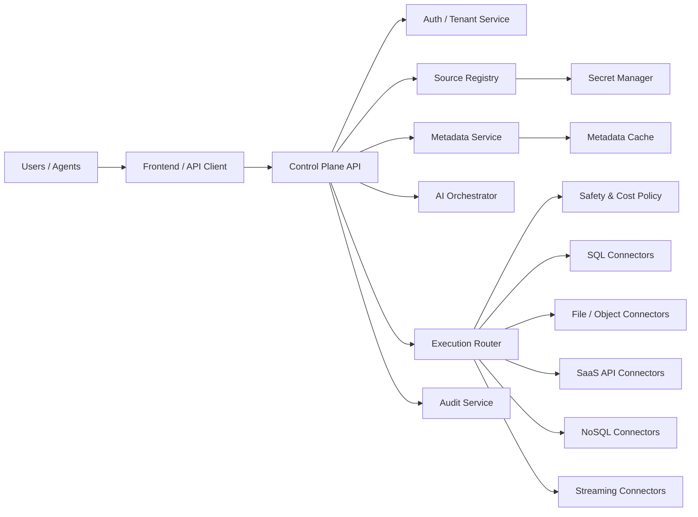

# Universal Connector Strategy

## Goal

Make AI Data Middleware the access layer for almost any platform that contains useful business data.

That does **not** mean one generic connector magically works everywhere.

It means the product needs a consistent abstraction over several source families:

- relational databases
- cloud data warehouses
- object storage and lakehouses
- SaaS business applications
- NoSQL and search systems
- files and spreadsheets
- streaming and event systems

## Product Principle

From the user's perspective, every source should feel the same:

1. Choose a source
2. Authenticate
3. Discover available datasets
4. Inspect schema
5. Ask a question
6. Review generated query or access plan
7. Get structured results

The backend may do very different things under the hood, but the user experience should stay consistent.

## Source Families

### 1. Relational databases

- PostgreSQL
- MySQL / MariaDB
- SQL Server
- Oracle
- SQLite

Execution style:

- native SQL
- direct schema introspection
- read-only query enforcement

### 2. Cloud data warehouses

- Snowflake
- BigQuery
- Redshift
- Databricks SQL
- Synapse SQL
- Microsoft Fabric Warehouse
- Amazon Athena
- Dremio
- Trino / Starburst
- ClickHouse Cloud

Execution style:

- dialect-aware SQL generation
- warehouse-specific cost and timeout controls
- metadata caching
- support for both warehouse tables and external-lake paths

### 3. Object storage and lakehouses

- Amazon S3
- Azure Blob Storage
- Azure Data Lake Gen2
- Google Cloud Storage
- Delta Lake
- Apache Iceberg
- Parquet / CSV / JSON folders

Execution style:

- file discovery
- schema inference
- virtual table creation
- DuckDB, Athena, Synapse Serverless, BigQuery external tables, or Snowflake external stages

### 4. SaaS business systems

- Salesforce
- HubSpot
- Zendesk
- Stripe
- Shopify
- QuickBooks
- NetSuite
- Workday
- ServiceNow

Execution style:

- API-backed connectors
- object/field discovery instead of table discovery
- incremental sync into a normalized query cache
- optional live API reads for small result sets

### 5. NoSQL and search platforms

- MongoDB
- Elasticsearch / OpenSearch
- DynamoDB
- Cassandra
- Couchbase
- Firebase / Firestore

Execution style:

- schema sampling or inferred document model
- query translation instead of plain SQL only
- optional normalization into a relational query layer for analytics-style questions

### 6. Files and spreadsheets

- Excel
- Google Sheets
- CSV uploads
- shared folders
- SharePoint / OneDrive documents

Execution style:

- file ingestion
- worksheet or tab discovery
- inferred columns and types
- virtual relational view for querying

### 7. Streaming and event systems

- Kafka
- Kinesis
- Pub/Sub
- Event Hubs

Execution style:

- stream snapshotting or materialized views
- time-windowed analytics
- query over buffered or persisted events

## Universal Source Contract

Every connector should normalize into one source contract.

### Core fields

- `source_id`
- `source_kind`
- `engine_key`
- `display_name`
- `auth_mode`
- `organization_id`
- `owner_user_id`
- `location`
- `namespace`
- `options_json`
- `secret_ref`
- `status`

### Supported `source_kind` values

- `database`
- `warehouse`
- `object_store`
- `lakehouse`
- `saas_app`
- `nosql`
- `file_source`
- `stream`

## Universal Metadata Contract

No matter what the source is, the product should expose a normalized metadata model:

- `datasets`
- `fields`
- `relationships`
- `sample_values`
- `source_path`
- `refresh_time`

For databases, a dataset is usually a table or view.

For object storage, a dataset is a virtual table backed by files.

For SaaS apps, a dataset may be an object like `accounts`, `tickets`, or `payments`.

For spreadsheets, a dataset may be a worksheet.

## Query Model by Source Family

The system should not force everything into the same execution method.

### SQL-native path

Use for:

- PostgreSQL
- MySQL
- SQL Server
- Oracle
- Snowflake
- BigQuery
- Redshift
- Databricks SQL
- Synapse SQL
- Microsoft Fabric Warehouse
- Athena
- Dremio
- Trino / Starburst
- ClickHouse

Flow:

- inspect schema
- generate dialect-aware SQL
- validate SQL
- execute query

### SQL-over-files path

Use for:

- S3
- Azure Blob
- ADLS
- GCS
- local files

Flow:

- discover files
- infer schema
- register virtual tables
- generate SQL
- execute with DuckDB, Athena, Synapse Serverless, or external-table engines

### API-backed path

Use for:

- Salesforce
- Stripe
- HubSpot
- Zendesk

Flow:

- inspect API objects and fields
- map question to object access plan
- either:
  - translate to API calls directly
  - or query a synced relational cache

### Query-translation path

Use for:

- MongoDB
- Elasticsearch
- DynamoDB

Flow:

- inspect collections or indexes
- infer structure
- translate user request into native query or normalized cached SQL layer

## Recommended Product Architecture

## Security Requirements

If the product will connect to many kinds of platforms, security must be stricter than the current prototype.

### Must-have controls

- encrypted secrets at rest
- short-lived tokens when available
- per-tenant isolation
- connector-level permission scopes
- query and scan limits
- per-source cost controls
- audit logs for every query and sync
- allowlists for paths, schemas, buckets, containers, and objects

### Special care areas

- SaaS OAuth token storage
- cloud IAM role assumptions
- warehouse credit usage
- large object-store scans
- cross-user leakage through cached metadata

## Connector Rollout Order

If the goal is broad usefulness quickly, build in this order:

### Phase 1

- PostgreSQL
- MySQL
- SQL Server
- Snowflake
- BigQuery
- Databricks SQL
- S3
- Azure Blob

### Phase 2

- Redshift
- Oracle
- Synapse SQL
- Microsoft Fabric Warehouse
- Athena
- Dremio / Trino
- ADLS Gen2
- Google Cloud Storage
- Google Sheets
- Excel uploads

### Phase 3

- Salesforce
- Stripe
- HubSpot
- Zendesk
- MongoDB
- Elasticsearch

### Phase 4

- DynamoDB
- Kafka
- Kinesis
- ServiceNow
- NetSuite
- Workday

## Practical Reality

“Any platform with data” is a strong product vision, but the right implementation is:

- one user experience
- many connector families
- one normalized metadata model
- multiple execution backends

That is the path to a real universal data access product.

## Recommended Next Build

To move from the current prototype toward this vision:

1. Add `source_kind` and `engine_key` to the core models
2. Replace “database connection” language in the UI with “data source”
3. Add S3 and Azure Blob as the first non-database connectors
4. Add DuckDB-backed virtual table querying for files
5. Add a persistent app database for tenants, sources, and metadata cache
6. Add auth and encrypted secret storage
